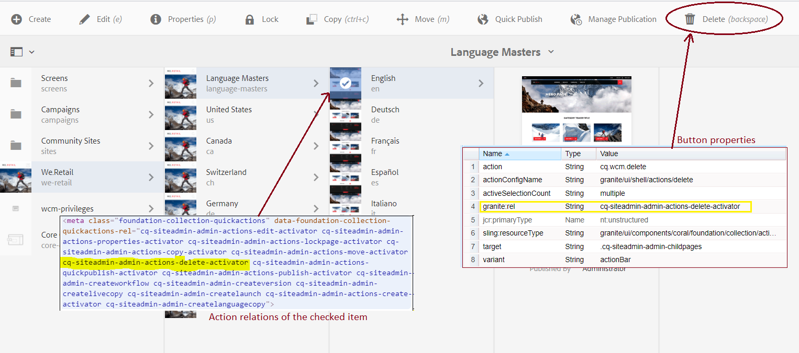

# Approaches To Show / Hide Components Based On Permissions

AEM comes with built-in rules to show/hide components depending on user privileges,
for example, if a user does not have a permission to replicate then the Publish button in Sites Admin is hidden, 
if the user does not have a permission to delete the page node then the Delete button is hidden, etc. 

From implementation point of view, permission-sensitive components can be categorized into two groups:
1. The show/hide behaviour is controlled by [render conditions](https://helpx.adobe.com/experience-manager/6-5/sites/developing/using/reference-materials/granite-ui/api/jcr_root/libs/granite/ui/docs/server/rendercondition.html) 
on the server side. In this case the decision if the button should be displayed or not 
is taken on the server side at page rendering time. A typical example is the [Assets Metadata Editor](http://localhost:4502/mnt/overlay/dam/gui/content/assets/metadataeditor.external.html?_charset_=utf-8&item=/content/dam/we-retail/en/activities/hiking/hiking_2.jpg)
where the state of the buttons is set at page load time and does not change. If the user selects a different asset 
the the page is redrawn completely.
2. The logic to show/hide buttons is evaluated on client side. Typical examples are 
collection pages like [Sites Admin](http://localhost:4502/sites.html/content/we-retail) where buttons in the selection toolbar are activated 
depending on whether the user has permissions to perform the action on the selected item. 

The principal difference between #1 and #2 is that a collection page activates buttons dynamically without redrawing the page, 
while render conditions exclude the button html from rendering completely at page render time.

## Show/Hide Button Using Render Condition
Render condition is a pluggable mechanism to decide if the component should be rendered or not. 
AEM ships with a number of render condition including `/libs/granite/ui/components/coral/foundation/renderconditions/privilege`
which will check based on the configured JCR privilege.

Given the following content structure:
```
+ my-button
  - jcr:title = "My Button"
  - sling:resourceType = granite/ui/components/coral/foundation/button
  + granite:rendercondition
    - sling:resourceType = granite/ui/components/coral/foundation/renderconditions/privilege
    - privileges = jcr:removeNode
    - path = ${requestPathInfo.suffix}
```

When the current session is able to remove the path specified by the request suffix, then the button is rendered;
otherwise it is not.

A good demo can be found at [1][1]

## Show/Hide Behaviour Evaluated On Client Side

The inner html in Touch UI Collections can be very different, but it follows common standards and conforms to the same CSS selection rules.

Every button in a collection selection toolbar has a css class which determines the show/hide behavior for that button. 
This css class is defined by the _granite:rel_ attribute in the button properties.
```
+ my-button
  - jcr:title = "My Button"
  - sling:resourceType = granite/ui/components/coral/foundation/button
  - granite:rel = cq-siteadmin-admin-actions-my-button-activator
```

On the other hand, regardless of the view, every item in a Touch UI collection has a child \<meta> tag containing so called
 action relations : 
 
 ```html
<meta class="foundation-collection-quickactions" data-foundation-collection-quickactions-rel="
 cq-siteadmin-admin-actions-my-button-activator  ..."
>
```
These are derived on the server side from user privileges and the code to emit the action relations 
 might look as follows:
```
private List<String> getActionRels(Resource resource, AccessControlManager acm) {
    List<String> actionRels = new ArrayList<String>();

    if (hasPermission(acm, resource, "crx:replicate")) {
        actionRels.add("cq-siteadmin-admin-actions-quickpublish-activator");
    }
    return actionRels;
}
```

When a user selects a collection item, AEM activates the selection toolbar and the buttons are shown *only* if their 
_granite:rel_ activator intersects with the metadata of the selected item.
In the example above, My Button will only be shown if the \<meta> tag of the checked item contains 
_cq-siteadmin-admin-actions-my-button-activator_




The default implementation that generates action relations for Sites Admins views can be found in 
- /libs/cq/gui/components/coral/admin/page/row/row.jsp
- /libs/cq/gui/components/coral/admin/page/column/column.jsp
- /libs/cq/gui/components/coral/admin/page/card/card.jsp

These components generate html for the corresponding collection views (card, column or row) and each of them contains
a method called _getActionRels_ which generates relations for the \<meta> tag


```
private List<String> getActionRels(Resource resource, Page page, AccessControlManager acm, boolean hasAnalytics) {
    List<String> actionRels = new ArrayList<String>();

    if (page != null) {
        actionRels.add("cq-siteadmin-admin-actions-edit-activator");
        actionRels.add("cq-siteadmin-admin-actions-properties-activator");
    } else {
        // for nt:folder there are no properties to edit
        if (!resource.isResourceType("nt:folder")) {
            actionRels.add("cq-siteadmin-admin-actions-folderproperties-activator");
        }
    }

    if (hasAnalytics) {
        actionRels.add("cq-siteadmin-admin-actions-open-content-insight-activator");
    }

    if (page != null && hasPermission(acm, resource, Privilege.JCR_LOCK_MANAGEMENT)) {
        if (!page.isLocked()) {
            actionRels.add("cq-siteadmin-admin-actions-lockpage-activator");
        } else if (page.canUnlock()) {
            actionRels.add("cq-siteadmin-admin-actions-unlockpage-activator");
        }
    }

    actionRels.add("cq-siteadmin-admin-actions-copy-activator");

    boolean canDeleteLockedPage = (page != null && page.isLocked() && page.canUnlock()) || (page != null && !page.isLocked()) || page == null;

    if (hasPermission(acm, resource, Privilege.JCR_REMOVE_NODE) && canDeleteLockedPage) {
        actionRels.add("cq-siteadmin-admin-actions-move-activator");
        actionRels.add("cq-siteadmin-admin-actions-delete-activator");
    }

    if (hasPermission(acm, resource, "crx:replicate")) {
        actionRels.add("cq-siteadmin-admin-actions-quickpublish-activator");
    }
    if (hasPermission(acm, "/etc/workflow/models", Privilege.JCR_READ)) {
        actionRels.add("cq-siteadmin-admin-actions-publish-activator");
    }

    boolean showCreate = false;

    if (page != null && (!page.isLocked() || page.canUnlock())) {
        actionRels.add("cq-siteadmin-admin-createworkflow");
        actionRels.add("cq-siteadmin-admin-createversion");
        showCreate = true;
    }

    if (hasPermission(acm, resource, Privilege.JCR_ADD_CHILD_NODES)) {
        actionRels.add("cq-siteadmin-admin-createlivecopy");
        showCreate = true;
    }

    if (!resource.getPath().equals("/content") && hasPermission(acm, "/content/launches", Privilege.JCR_ADD_CHILD_NODES)) {
        actionRels.add("cq-siteadmin-admin-createlaunch");
        showCreate = true;
    }

    if (showCreate) {
        actionRels.add("cq-siteadmin-admin-actions-create-activator");
        actionRels.add("cq-siteadmin-admin-createlanguagecopy");
    }
    if(page!=null){
        ValueMap pageProperties = page.getProperties();
        if(pageProperties !=null && pageProperties.containsKey("cq:lastTranslationDone")){
            //this is translation page
            actionRels.add("cq-siteadmin-admin-actions-translation-update-memory");
        }
    }

    return actionRels;
} 
```

### Default Permission Model in Sites Admin (Simplified)

| Button  | Required Privilege | Activator class (granite:rel)  |
| :------------------- | :------------------- |:---------------|
| Edit  | jcr:read | cq-siteadmin-admin-actions-edit-activator |
| Properties | jcr:read | cq-siteadmin-admin-actions-properties-activator |
| Lock  | jcr:lockManagement | cq-siteadmin-admin-actions-lockpage-activator |
| Copy  | jcr:read | cq-siteadmin-admin-actions-copy-activator |
| Move  | jcr:removeNode | cq-siteadmin-admin-actions-move-activator|
| Delete  | jcr:removeNode | cq-siteadmin-admin-actions-delete-activator|
| Publish/Unpublish | jcr:read on /etc/workflow/models | cq-siteadmin-admin-actions-publish-activator |
| Quick Publish | crx:replicate | cq-siteadmin-admin-actions-quickpublish-activator |

### Customizing The Default Model

The key to customizing permission-aware buttons is to:
1. define [custom privileges](./privileges.md)
2. define buttons with custom granite:rel activators
3. change the [_getActionRels_](../ui.apps/src/main/content/jcr_root/apps/cq/gui/components/coral/admin/page/common/permissions.jsp) routine and emit the new activators based on user access

[1]: https://github.com/nateyolles/aem-granite-rendercondition-demo